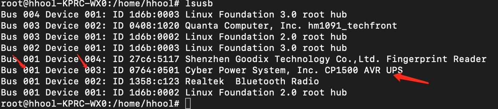

# NUT UPS Driver for ZSPACE

## Overview

Guide to install NUT UPS Driver for ZSPACE. This guide is based on Ubuntu 22.04 LTS. The NUT UPS Driver for ZSPACE is a Docker image that contains the following components:

- [NUT](https://networkupstools.org/) - Network UPS Tools
- [nut-upsd](https://github.com/upshift-docker/nut-upsd) - NUT UPS Driver for ZSPACE
- [webnut](https://hub.docker.com/r/teknologist/webnut/dockerfile) - Web interface for NUT

## Installation

### Ubuntu 22.04 LTS (x86_64)

cd root directory of zspace_nut

```bash
sudo bash ups_daemon.sh > /dev/null 2>&1 &
```

### More details


```bash
sudo lsusb
```



```text
--device /dev/bus/usb/001/003
```

```bash
docker run -d --name=nut-upsd --hostname=nut-upsd --restart=always --network=host --device /dev/bus/usb/001/003 -e UPS_NAME="zspace_ups" -e UPS_DESC="Server - zspace ups U2600" -e UPS_DRIVER="usbhid-ups" -e UPS_PORT="auto" -e API_USER="upsmon" -e API_PASSWORD="123456789ABCDEFGH" -e ADMIN_PASSWORD="123456789ABCDEFGH" -e SHUTDOWN_CMD="echo 'Home has no current. Proceeding to shut down...'" hhool/zspace_nut_ups:v1.0
```

```bash
docker run -d --name=webnut --hostname=webnut --restart=always --network=host -e UPS_HOST="127.0.0.1" -e UPS_PORT="3493" -e UPS_USER="upsmon" -e UPS_PASSWORD="123456789ABCDEFGH" teknologist/webnut:latest
```

open [http://localhost:6543](http://localhost:6543) in your browser at Ubuntu 22.04 LTS

## References

- [Integrating a UPS in our server](https://www.danielmartingonzalez.com/en/integrating-ups-server/) - Daniel Martín González
- [Network UPS Tools](https://networkupstools.org/) - Network UPS Tools - NUT - Homepage

## TODO

- test with other pc visit webnut.
- support multiple UPS devices with different drivers.
- support automatic detection of UPS devices. (currently only supports USB UPS devices)
- support automatic plug in and plug out of UPS devices. restart the container when the UPS device is plugged in again.
